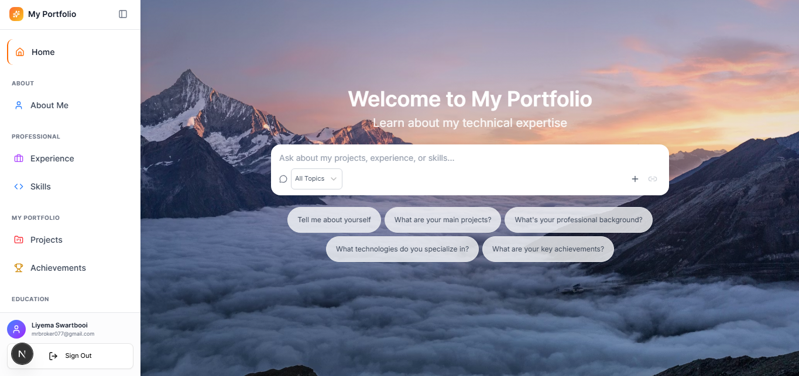

# AI-Powered Interactive Portfolio



> **An intelligent, full-stack portfolio application featuring AI-powered chat assistance, real-time content management, and a modern, responsive design built with Next.js and Supabase.**

## 🎯 Overview

This is a cutting-edge portfolio application that combines traditional portfolio presentation with **AI-powered interactive chat functionality**. Visitors can engage with an intelligent assistant to learn about the developer's experience, projects, skills, and achievements in a conversational manner.

### Key Highlights

- **🤖 AI Chat Assistant**: Interactive chat interface powered by AI that answers questions about the portfolio owner's background, projects, and expertise
- **📱 Fully Responsive**: Optimized for all devices with mobile-first design principles
- **⚡ Real-time Updates**: Live content editing with instant database synchronization
- **🔐 Secure Authentication**: Supabase-powered authentication with OAuth support
- **🎨 Modern UI/UX**: Beautiful, animated interface built with Framer Motion and Tailwind CSS
- **📊 Comprehensive Sections**: Experience, Projects, Skills, Education, Achievements, Certificates, and more

---

## 🚀 Features

### Core Functionality

1. **Interactive AI Chat**
   - Natural language queries about portfolio content
   - Context-aware responses using portfolio data
   - Session management and chat history
   - Multiple AI model support

2. **Portfolio Sections**
   - **Home**: AI chat interface
   - **About**: Profile, statistics, values, and personality traits
   - **Experience**: Career timeline with detailed achievements
   - **Skills**: Categorized technical skills with visual indicators
   - **Projects**: Featured projects with technologies and live demos
   - **Education**: Academic timeline with achievements
   - **Achievements**: Awards, recognitions, and competitions
   - **Certificates**: Professional certifications
   - **Resume**: Downloadable CV template
   - **Journey**: Visual journey gallery
   - **Testimonials**: Client and colleague recommendations
   - **Contact**: Contact form and social links

3. **Admin Features**
   - Edit mode for real-time content updates
   - Image uploads for projects, achievements, and certificates
   - Drag-and-drop reordering
   - Inline editing with auto-save

4. **Technical Excellence**
   - Server-side rendering (SSR) for optimal performance
   - TypeScript for type safety
   - Optimized database queries with Supabase
   - Secure API routes with validation
   - Error boundaries and loading states

---

## 🛠️ Technology Stack

### Frontend
- **Framework**: Next.js 16.0.3 (App Router)
- **UI Library**: React 19.2.0
- **Styling**: Tailwind CSS 4
- **Animations**: Framer Motion 12.23.24
- **UI Components**: Radix UI (shadcn/ui)
- **Icons**: Lucide React
- **State Management**: React Context API
- **Notifications**: Sonner

### Backend & Database
- **Backend**: Next.js API Routes
- **Database**: Supabase (PostgreSQL)
- **Authentication**: Supabase Auth with OAuth
- **File Storage**: Supabase Storage
- **Real-time**: Supabase Realtime subscriptions

### Development Tools
- **Language**: TypeScript 5
- **Package Manager**: pnpm
- **Linting**: ESLint with Next.js config
- **Build Tool**: Turbopack

---

## 📁 Project Structure

```
portfolio/
├── app/                    # Next.js App Router
│   ├── api/               # API routes for CRUD operations
│   ├── auth/               # Authentication callbacks
│   ├── layout.tsx          # Root layout
│   └── page.tsx            # Main page with navigation
├── components/             # React components
│   ├── content/            # Portfolio section components
│   ├── ui/                 # Reusable UI components (shadcn)
│   ├── auth/               # Authentication components
│   └── sidebar/            # Sidebar navigation
├── contexts/               # React Context providers
├── hooks/                  # Custom React hooks
├── lib/                    # Utility functions
│   ├── supabase/           # Supabase client configuration
│   └── utils/              # Helper functions
├── public/                 # Static assets
└── middleware.ts          # Next.js middleware for auth
```

---

## 🚀 Getting Started

### Prerequisites

- Node.js 18+ or higher
- pnpm (recommended) or npm
- Supabase account and project

### Installation

1. **Clone the repository**
   ```bash
   git clone <repository-url>
   cd portfolio
   ```

2. **Install dependencies**
   ```bash
   pnpm install
   # or
   npm install
   ```

3. **Set up environment variables**
   
   Create a `.env.local` file in the root directory:
   ```env
   NEXT_PUBLIC_SUPABASE_URL=your_supabase_url
   NEXT_PUBLIC_SUPABASE_ANON_KEY=your_supabase_anon_key
   SUPABASE_SERVICE_ROLE_KEY=your_service_role_key
   ```

4. **Run the development server**
   ```bash
   pnpm dev
   # or
   npm run dev
   ```

5. **Open your browser**
   
   Navigate to [http://localhost:3000](http://localhost:3000)

### Build for Production

```bash
pnpm build
pnpm start
```

---

## 🎨 Key Features Explained

### AI Chat Assistant

The AI chat feature allows visitors to ask questions about the portfolio owner in natural language. The system:

- Fetches comprehensive portfolio data from Supabase
- Builds context-aware prompts
- Provides intelligent responses about experience, projects, and skills
- Maintains conversation history per session

### Edit Mode

Authenticated users can enable edit mode to:

- Update content in real-time
- Upload images for projects and achievements
- Reorder items via drag-and-drop
- Add/remove portfolio sections dynamically

### Responsive Design

The application is fully responsive with:

- Mobile-first approach
- Touch-optimized interactions
- Adaptive layouts for tablets and desktops
- Optimized images and lazy loading

---

## 📊 Database Schema

The application uses Supabase (PostgreSQL) with the following main tables:

- `profiles` - User profile information
- `experiences` - Work experience entries
- `projects` - Portfolio projects
- `skills` & `skill_categories` - Technical skills
- `education` - Academic background
- `achievements` - Awards and recognitions
- `certifications` - Professional certificates
- `testimonials` - Client recommendations
- `contact_info` & `social_links` - Contact information
- `cv_sections` - Resume template content
- `chat_messages` - AI chat history

---

## 🔒 Security Features

- **Row Level Security (RLS)**: Database-level security policies
- **OAuth Integration**: Secure authentication flows
- **API Route Protection**: Server-side validation
- **Input Sanitization**: XSS and injection prevention
- **Secure File Uploads**: Validated image uploads

---

## 🎯 Performance Optimizations

- **Server-Side Rendering**: Fast initial page loads
- **Code Splitting**: Optimized bundle sizes
- **Image Optimization**: Next.js Image component
- **Database Query Optimization**: Parallel queries and caching
- **Lazy Loading**: Components loaded on demand

---

## 📝 API Endpoints

The application includes comprehensive API routes for:

- Profile management (`/api/about/profile`)
- Experience CRUD (`/api/experience`)
- Projects management (`/api/projects`)
- Skills management (`/api/skills`)
- Education management (`/api/education`)
- Achievements (`/api/achievements`)
- Certificates (`/api/certificates`)
- Chat functionality (`/api/chat`)
- File uploads (`/api/*/upload`)

---

## 🧪 Development

### Available Scripts

- `pnpm dev` - Start development server
- `pnpm build` - Build for production
- `pnpm start` - Start production server
- `pnpm lint` - Run ESLint

### Code Quality

- TypeScript for type safety
- ESLint for code linting
- Consistent code formatting
- Component-based architecture

---

## 🌟 Highlights for Recruiters

### Technical Skills Demonstrated

1. **Full-Stack Development**
   - Next.js App Router with Server Components
   - RESTful API design and implementation
   - Database design and optimization

2. **Modern Frontend**
   - React 19 with hooks and context
   - Responsive design with Tailwind CSS
   - Advanced animations with Framer Motion
   - Component composition and reusability

3. **Backend & Database**
   - Supabase/PostgreSQL integration
   - Real-time data synchronization
   - Secure authentication and authorization
   - File storage and management

4. **AI Integration**
   - AI chat implementation
   - Context-aware responses
   - Session management

5. **DevOps & Best Practices**
   - TypeScript for type safety
   - Error handling and validation
   - Performance optimization
   - Security best practices

### Project Quality Indicators

- ✅ Production-ready codebase
- ✅ Comprehensive error handling
- ✅ Responsive and accessible UI
- ✅ Secure authentication
- ✅ Optimized performance
- ✅ Clean, maintainable code structure
- ✅ Type-safe TypeScript implementation

---

## 📧 Contact

For questions about this portfolio or to discuss opportunities:

- **Email**: liyemaswartbooi77@gmail.com
- **Phone**: +27 69 465 4988
- **GitHub**: [https://github.com/LiyemaSwartooi](https://github.com/LiyemaSwartooi)
- **Location**: South Africa

---

## 📄 License

This project is private and proprietary.

---

## 🙏 Acknowledgments

- Built with [Next.js](https://nextjs.org/)
- UI components from [shadcn/ui](https://ui.shadcn.com/)
- Database and authentication by [Supabase](https://supabase.com/)
- Icons by [Lucide](https://lucide.dev/)

---

**Note**: This portfolio demonstrates advanced full-stack development skills, modern web technologies, and best practices in software engineering. The AI-powered chat feature showcases innovation and user experience focus.
